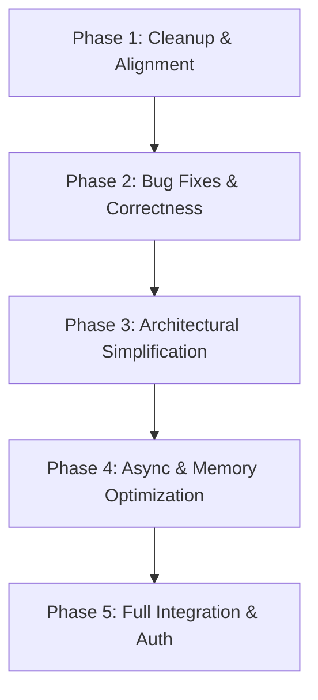

# VaultOps Codebase Architecture & Code-Quality Audit

This report presents a comprehensive static architecture and code-quality audit of the **VaultOps** project, covering both the backend (Spring Boot/Java) and frontend (React/TypeScript) codebases. The objective is to identify architectural anti-patterns, performance bottlenecks, runtime bugs, and testing deficits, and to lay out an actionable, phased refactoring plan.

---

## 1. File Structure & Organization Anomalies

During the initial codebase scan, several structural anomalies and file system smells were identified:

### 1.1 Misspelled and Duplicate Directories
* **Frontend Typo**: The active React codebase resides in a folder named `fontend/` (missing the "r"). An empty directory named `frontend/` also exists at the root.
* **Stray Directory**: An empty folder named `Client/` exists at the root, which represents dead folder structure.
* **Action**: Rename `fontend/` to `frontend/`, and delete the empty `frontend/` and `Client/` directories to prevent confusion.

### 1.2 Duplicate and Misspelled Structure Files
* **Root File**: `structure.txt` (474 KB) exists in the repository root.
* **Backend File**: `structre.txt` (32 KB, note the spelling typo) exists in `backend/vaultops/`.
* **Action**: Delete both files. Project structure should be managed dynamically (e.g., using `tree` in documentation or README) rather than committing manual text listings that quickly fall out of date.

### 1.3 Misplaced Root-Level Interfaces
* **Files**: `Command.java` and `Query.java` reside directly in the root package (`com.vaultops`) rather than in dedicated packages (e.g., `com.vaultops.core.cqrs` or `com.vaultops.common`).
* **Functional Duplication**: Both interfaces are functionally identical:
  ```java
  // Command.java
  public interface Command<I, O> {
      ResponseEntity<O> execute(I input);
  }
  
  // Query.java
  public interface Query<I, O> {
      ResponseEntity<O> execute(I input);
  }
  ```
* **Architectural Smell**: This creates a rigid and over-engineered Command-Query separation pattern that forces the creation of a separate service class for every single HTTP endpoint.

---

## 2. Architectural & Design Analysis

### 2.1 The CQRS Service Explosion
The codebase enforces a rigid "one class per API operation" pattern. While this isolates logic, it results in massive class explosion and boilerplate:
* **CRUD Services**: The `services/asset` package contains 8 separate classes (`CreateAssetService`, `GetAssetService`, `GetAssetsService`, `UpdateAssetService`, `DeleteAssetService`, `SearchAssetService`, `GetTopFourAssetsInUseService`, `GetTopFourAssetsInRepairsService`) for basic CRUD operations. A single unified `AssetService` could easily handle these with standard service methods.
* **Stats Services**: The `services/stats` package contains 10 separate service classes, one for each specific count or duration calculation (e.g., `GetAssetsInUseService`, `GetAssetsInStorageService`, `GetExcellentConditionAssetsService`).

### 2.2 DTO Duplication
* **Files**: `AssetDTO.java` and `AssetDTO2.java` in `com.vaultops.dtos`.
* **Redundancy**: `AssetDTO` exposes the full set of entity fields, while `AssetDTO2` exposes a subset (`name`, `serialNumber`, `conditionStatus`, `usageStatus`, `assignedTo`). Having two separate constructor-based DTO classes for the same resource increases boilerplate and code maintenance. They should be unified or replaced with Java records.

### 2.3 Commented-out and Unused Dead Code
* **Google Sheets Integration**: 
  - `GoogleSheetsConfig.java`
  - `GoogleSheetsImportService.java`
  - `GoogleSheetsExportService.java`
  - These classes are 100% commented out. The application defines dependencies for Google APIs in `pom.xml`, but the feature itself is dead code.
* **Dead Exceptions**: 
  - `NoAssetsMessageException.java` is defined and handled in `GlobalExceptionHandler.java`, but is never thrown anywhere in the active backend code (only imported in `GetDamagedConditionAssetsService.java`).
  - `JobNotFoundException.java` is defined but never referenced or thrown anywhere.

### 2.4 Unused Configuration Files
* **Async Config**: `AsyncConfig.java` defines a task executor for asynchronous execution, but no service uses the `@Async` annotation. Import and export operations are entirely synchronous.
* **Cache Config**: `CacheConfiguration.java` configures an in-memory cache manager, but no repositories or service methods use `@Cacheable` or `@CacheEvict`.

---

## 3. Backend Logic & Runtime Bugs

### 3.1 Fatal Temporal Calculation Bug in `GetNumberOfDayInRepairsService`
* **File**: `backend/vaultops/src/main/java/com/vaultops/services/stats/GetNumberOfDayInRepairsService.java#L30-L33`
* **Code**:
  ```java
  LocalDateTime serviceDate = asset.getCreatedAt();
  LocalDate currentDate = LocalDate.now();
  Long days = ChronoUnit.DAYS.between(serviceDate, currentDate); // Throws DateTimeException at runtime!
  ```
* **Bug Details**: `ChronoUnit.DAYS.between` requires two temporals of compatible types. Passing a `LocalDateTime` and a `LocalDate` directly will result in a runtime `DateTimeException` because the `LocalDate` does not contain time component information to align with `LocalDateTime`.
* **Fix**: Convert `LocalDateTime` to `LocalDate` first:
  ```java
  LocalDate serviceDate = asset.getCreatedAt().toLocalDate();
  LocalDate currentDate = LocalDate.now();
  Long days = ChronoUnit.DAYS.between(serviceDate, currentDate);
  ```

### 3.2 Backend-Frontend Enum Mismatches
There are significant discrepancies between enum modeling on the backend and frontend:
* **Usage Enum Mismatches**:
  - **Backend (`com.vaultops.enums.Usage`)**: `IN_USE`, `STORAGE`, `SERVICE`
  - **Frontend (`AssetTools.tsx`)**: `IN_USE`, `IN_STORAGE`, `IN_SERVICE`, `DAMAGED`
* **Condition Status Mismatches**:
  - **Backend (`com.vaultops.enums.ConditionStatus`)**: `EXCELLENT`, `GOOD`, `FAIR`, `BAD`, `DAMAGED`
  - **Frontend (`AssetTools.tsx`)**: `EXCELLENT`, `GOOD`, `FAIR`, `POOR`
* **Consequence**: Since the frontend uses values like `IN_STORAGE` and `IN_SERVICE` but the backend expects `STORAGE` and `SERVICE`, attempts to send frontend-generated values to the backend will trigger HTTP 400 Bad Request (due to enum parsing failures).

### 3.3 Incorrect and Inefficient "Top 4" Ordering
* **Files**: `GetTopFourAssetsInUseService.java` and `GetTopFourAssetsInRepairsService.java`
* **Code**:
  ```java
  List<Asset> assets = assetRepository.findAssetsByUsageStatus(Usage.IN_USE).stream().limit(4).toList();
  List<AssetDTO2> assetDTOS = assets.stream()
          .sorted(Comparator.comparing(Asset::getCreatedAt).reversed())
          .map(AssetDTO2::new).toList();
  ```
* **Performance Bug**: It fetches **all** assets of a given status from the database, loads them into memory, slices the list to 4 *before sorting*, and then sorts only those 4 arbitrary records. This is both highly inefficient (database loads everything) and logically incorrect (it retrieves 4 arbitrary records from the DB instead of the actual top 4 most recently created assets).
* **Fix**: Add sorting and page limitation at the database query level using JPA query method naming or `Pageable`:
  ```java
  // In AssetRepository
  List<Asset> findTop4ByUsageStatusOrderByCreatedAtDesc(Usage usageStatus);
  ```

### 3.4 Blocking and Memory-Heavy Import/Export Logic
* **Excel Export**: `AssetExportService.exportToExcel` loads all records from the database and instantiates an in-memory workbook using Apache POI's `XSSFWorkbook`. This is loaded into a `ByteArrayOutputStream` in memory. If there are 50,000 assets, this will exhaust the JVM heap and cause an `OutOfMemoryError`.
* **Imports**: `AssetImportService.processImport` is completely synchronous and blocking. If a user uploads an Excel file with thousands of rows, the HTTP request will block, potentially causing a timeout.

---

## 4. Frontend Implementation State

The frontend React application is currently a high-fidelity visual mockup. It looks polished but lacks functional integration with the backend:

### 4.1 Mocked Authentication
* **Files**: `SignIn.tsx`, `SignUp.tsx`, `OtpActivation.tsx`
* **Stubs**: `HandleLoginAsync` in `SignIn.tsx` does not make any API calls; it directly redirects to `/portal`. `HandleRegisterUserAsync` in `SignUp.tsx` and the OTP activation form only use `setTimeout` to simulate backend API calls.

### 4.2 Static Dashboard & Assets Grid
* **Files**: `Dashboard.tsx` and `Assets.tsx`
* **Stubs**: Both pages load static arrays (`stats`, `recentAssets`, `DUMMY_ASSETS`) hardcoded inside `DashboardTools.ts` and `AssetTools.tsx`. They never make HTTP requests to the backend REST endpoints.

### 4.3 Broken Sidebar Highlighting and Missing Icons
* **Prop Leakage**: `Portal.tsx` mounts `Sidebar` like so:
  ```tsx
  <Sidebar activeTab={''} setActiveTab={function (tab: string): void { throw new Error('Function not implemented.'); }} />
  ```
* **Bugs**:
  1. Passing an empty string for `activeTab` breaks the active navigation tab styling.
  2. Clicking on links does not trigger state updates since `setActiveTab` throws a runtime error.
  3. Icons are imported in `SidebarTools.tsx` but never rendered in the actual `Sidebar.tsx` UI.
* **Fix**: Use React Router's native `<NavLink>` component to style active routes dynamically without manually tracking tab states or passing dummy callbacks.

---

## 5. Testing & Verification Gaps

* **Testing Deficit**: The codebase contains 39 passing Maven tests, but coverage is extremely lopsided:
  - **Tested**: Only `AssetController` and the asset CRUD services in `services/asset`.
  - **Untested**: Export, Import, Stats, Maintenance, and Migration controllers and services have **0% coverage**.
  - **Empty Packages**: The test directory `com.vaultops.assets.repository` is completely empty. Database-level constraints, custom queries, and repository methods are untested.

---

## 6. Phased Refactoring Strategy

We propose a phased, risk-mitigated refactoring plan to transition VaultOps from a mockup to a production-ready, clean system.



### Phase 1: Structural Cleanup & Alignment
* [ ] **Rename & Delete Directories**: Rename `fontend/` to `frontend/`. Remove the empty `frontend/` and `Client/` folders.
* [ ] **Delete Stray Files**: Remove `structure.txt` and `backend/vaultops/structre.txt`.
* [ ] **Unify Enums**: Align frontend enums in `AssetTools.tsx` with backend enums (`Usage` and `ConditionStatus`) to prevent API errors.

### Phase 2: Runtime Bug Fixes & Code Correctness
* [ ] **Temporal Fix**: Correct the temporal comparison in `GetNumberOfDayInRepairsService.java` by calling `toLocalDate()`.
* [ ] **Top 4 Sorting Fix**: Update `AssetRepository` to support `findTop4ByUsageStatusOrderByCreatedAtDesc` and update the services to fetch sorted and limited results directly from the DB.
* [ ] **Sidebar Active Styling**: Refactor `Sidebar.tsx` to use React Router `NavLink` with classes based on active state.

### Phase 3: Architectural Simplification
* [ ] **Consolidate Stats Services**: Replace the 10 separate stats services with a single `StatsService` that returns a single unified `DashboardStatsDTO` object to minimize backend class explosion and frontend HTTP round trips.
* [ ] **Unify Asset CRUD Services**: Consolidate individual CRUD services in `services/asset` into a single, clean `AssetService` class.
* [ ] **Remove Dead Code**: Delete commented-out Google Sheets configuration/services and unused exceptions (`JobNotFoundException`, `NoAssetsMessageException`).

### Phase 4: Async & Memory Optimization
* [ ] **Streaming Exports**: Implement `SXSSFWorkbook` (Streaming User Model API) in `AssetExportService` to write records in chunks and stream directly to client response streams, avoiding JVM memory overflow.
* [ ] **Asynchronous Imports**: Implement a simple task queuing mechanism using Spring `@Async` (using the defined `AsyncConfig.java`) for processing uploaded spreadsheets, updating import status in the database log.

### Phase 5: Full Integration & Authentication
* [ ] **Backend Security & Auth**: Implement real Spring Security with JWT token validation and password hashing.
* [ ] **Frontend API Calls**: Replace mockups with actual HTTP client calls (using `fetch` or `axios`) on the `SignIn`, `SignUp`, `Dashboard`, and `Assets` pages.
* [ ] **Complete Test Baseline**: Add unit and integration tests for stats, import/export operations, and the database repository layer.
